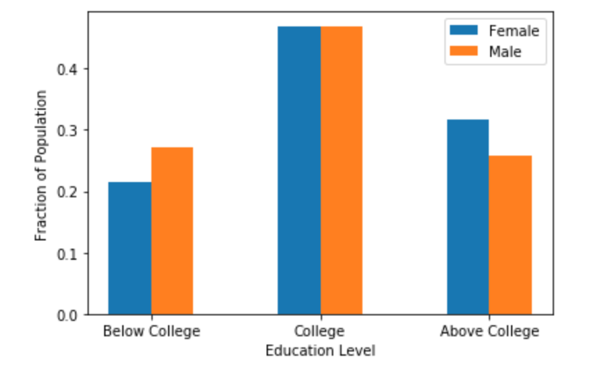
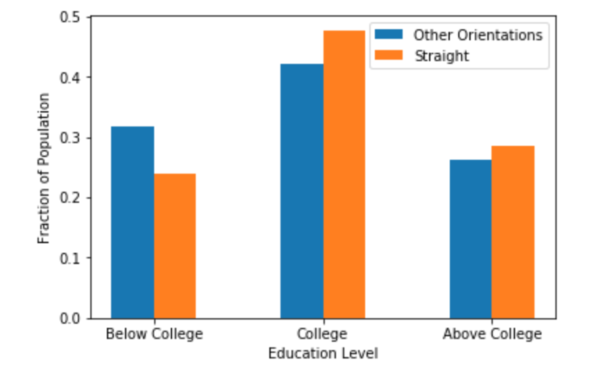
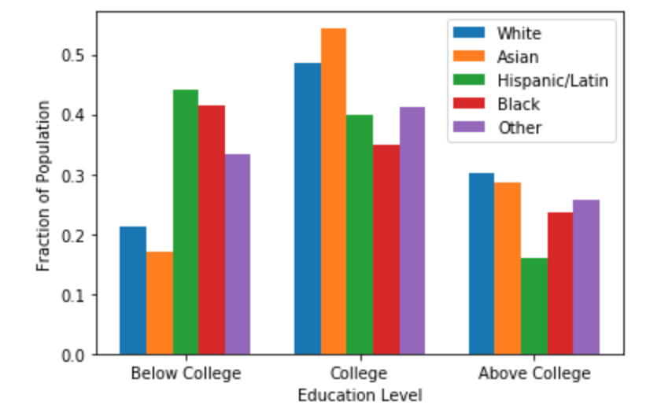

# On Educatioal Equity in CA

In this project, I looked at the educational equity in CA based on the information on age, gender, sexual orientation, ethnicity and education level of approximately 50000 individuals using a dataset provided by OkCupid, an online dating app. 

It turns out that gender does not affect the educational equity much.

Similar to gender, sexual orientation does affect the level of education of people in CA. 

Interestingly, ethnicity has a more significant effect on the education level distribution than gender and sexual orientation. On average, whites and asians have a higher level of education than other ethnicities. 

I am sharing the jupyetr notebook of the project on this repository: Educational_Equity_CA.ipynb

